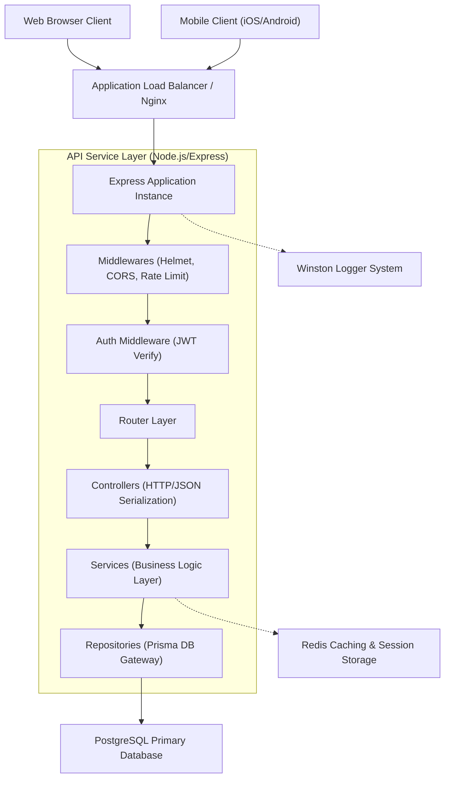
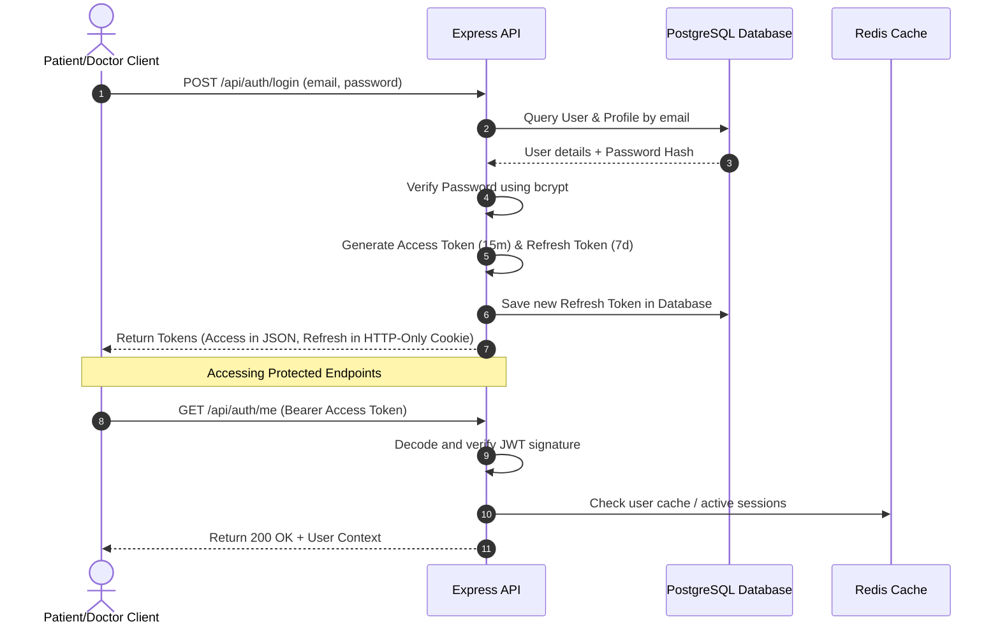
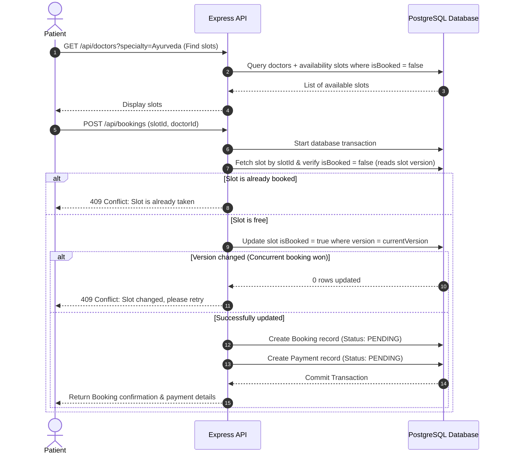
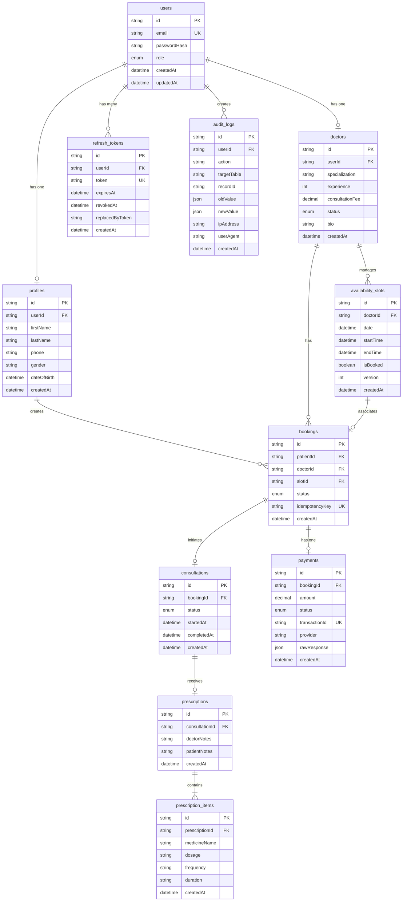

# High-Level Architecture Documentation

This document describes the architectural layout, components, data flows, and workflow patterns for the Amrutam Pharmaceuticals Telemedicine Platform.

---

## 1. High-Level System Architecture

The platform is designed around a clean three-tier architecture (Client-API-Data), which separates concerns and enables separate scalability across the application stack.



---

## 2. Component Responsibilities

The system adopts a modular clean architecture where each folder layer has strict boundaries and single responsibility:

| Layer | Responsibility | Details |
| :--- | :--- | :--- |
| **Server/App** (`server.ts`, `app.ts`) | Initialization & Server Boot | Mounts global middleware, handles DB/Redis connections, handles OS signals for graceful shutdown, and opens HTTP ports. |
| **Middlewares** (`src/middlewares/`) | Request preprocessing and filters | Standardizes security modifications (Helmet/CORS), checks throttling policies (Rate Limiter), assigns correlation metadata, and intercept errors. |
| **Validators** (`src/validators/`) | Request Schema validation | Validates raw payload shapes (body, query, params) using `Zod` schemas before letting requests hit the controller layer. |
| **Controllers** (`src/modules/*/auth.controller.ts`) | Payload Serialization | Parses validated HTTP request bodies, interacts with service classes, and serializes JS objects to outgoing JSON responses. |
| **Services** (`src/modules/*/auth.service.ts`) | Core Business Logic | Orchestrates domain validation, triggers audit logs, handles token generation mechanics, and manages transaction boundaries. |
| **Repositories** (`src/modules/*/auth.repository.ts`) | Data Gateway (ORM isolation) | Performs queries/mutations to PostgreSQL via the Prisma Client. Isolates business rules from raw database queries. |
| **Prisma Engine** (`prisma/schema.prisma`) | Data persistence layer | Orchestrates physical schema updates, constraints, and models. |

---

## 3. Data Flow & Request Lifecycle

Every HTTP request sent to the API follows a deterministic structural journey:

```text
[HTTP Request] 
      │
      ▼
1. Security & Rate-Limit Middlewares (Helmet / CORS / express-rate-limit)
      │
      ▼
2. Correlation ID Middleware (Generates x-request-id & x-correlation-id)
      │
      ▼
3. JWT Authentication Middleware (Checks Bearer token & blacklist/revocation)
      │
      ▼
4. Validation Middleware (Runs input schemas via Zod)
      │
      ▼
5. Controller Layer (Maps request parameters, forwards to Service)
      │
      ▼
6. Service Layer (Executes transactional business logic, updates state)
      │
      ▼
7. Repository Layer (Executes SQL query via Prisma Client)
      │
      ▼
8. Database (State updated / fetched)
      │
      ▼
[HTTP Response Serialized as JSON]
```

---

## 4. Primary Workflows

### A. Authentication & Session Flow

The platform utilizes a secure JWT-based authentication system with Refresh Token Rotation. This allows patients and doctors to maintain sessions safely without sending passwords repeatedly.



---

### B. Booking & Availability Workflow

The telemedicine application implements a multi-step booking sequence that guarantees safety against race conditions (double booking) using **Optimistic Locking** on availability slots.



---

## 5. Entity-Relationship Diagram (ERD)

The database schema, implemented in PostgreSQL via Prisma, supports full referential integrity and is diagrammed below:



---

## 6. Architectural Tradeoffs & Design Decisions

### Monolithic Modular Design vs Microservices
* **Decision**: We opted for a modular monolithic directory structure.
* **Why**: The project scale does not warrant the overhead, complex networking, and operational costs of microservices. By enforcing strict boundaries (e.g. `src/modules/auth`), we can transition specific domains into separate services in the future if they develop distinct scaling profiles.
* **Tradeoff**: While code resides in one repository, deployment scaling is performed horizontally as a single unit rather than isolated components.

### ORM vs Raw SQL
* **Decision**: Use **Prisma ORM** for database interaction.
* **Why**: Provides strict compile-time TypeScript type safety for database models, fast migrations, and high developer efficiency.
* **Tradeoff**: Prisma is historically known for higher engine overhead and query-generation complexities compared to raw SQL queries or lightweight query builders (like Knex). We mitigate this by using connection poolers (pgBouncer) and adding manual indexing on query-intensive columns (like `doctorId`, `patientId`, `token`).
