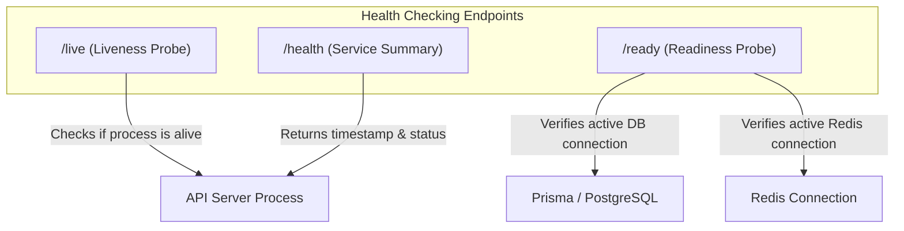

# System Observability & Monitoring

This document details the telemetry, logging, health check endpoints, tracing, and metric alerts configured for the Amrutam Pharmaceuticals Telemedicine Platform.

---

## 1. Structured Logging System (Winston)

To support production log processing systems (such as Datadog, ELK Stack, or AWS CloudWatch), the API uses **Winston** to generate structured, machine-readable logs.

### A. Format & Output
- **Production Mode**: Logs are output in **JSON format** to stdout/stderr. Stack traces are captured as nested properties inside the log payload instead of long text blocks.
- **Development Mode**: Logs are output to the console in a colorized, human-readable format.
- **File Transports**: Winston is configured to stream logs to dedicated files (`logs/combined.log` for general logs and `logs/error.log` for error-level logs), enabling simple local debugging and system recovery audits.

### B. Winston Configuration Summary
```typescript
const logger = winston.createLogger({
  level: config.NODE_ENV === 'production' ? 'info' : 'debug',
  format: combine(
    errors({ stack: true }),
    timestamp({ format: 'YYYY-MM-DD HH:mm:ss.SSS' }),
    metadata(),
    redactSensitive() // Custom format to redact passwords, JWT tokens, etc.
  ),
  transports: [
    new winston.transports.Console(),
    new winston.transports.File({ filename: 'logs/error.log', level: 'error' }),
    new winston.transports.File({ filename: 'logs/combined.log' })
  ]
});
```

---

## 2. Request Correlation Tracing

In highly scaled environments, a single client request can trigger dozens of queries or background events. To trace operations across services:

1. **Correlation IDs Middleware** (`src/middlewares/request.middleware.ts`):
   - Every request is assigned a unique **Request ID** (`x-request-id`) to trace that specific transaction lifecycle.
   - If the request originates from an upstream system with a **Correlation ID** (`x-correlation-id`), the API preserves it; otherwise, it generates a new UUID.
   - These IDs are attached as HTTP headers to the outgoing response.
2. **Log Enrichment**:
   Every log statement fired during a request context includes these IDs, enabling developers to search log systems for a specific correlation ID and view the complete end-to-end execution path:
   ```json
   {
     "timestamp": "2026-07-12 09:26:01.408",
     "level": "error",
     "message": "Error: Invalid email or password",
     "correlationId": "ac89acdc-7620-4165-b454-40aa73663db3",
     "requestId": "d22b1bcd-b6b8-4f95-9499-95c9586b5308",
     "stack": "Error: Invalid email or password\n    at AuthService.login (..."
   }
   ```

---

## 3. Health & Probes Check Architecture

The platform implements the standard cloud health check architecture to cooperate with Kubernetes/Docker Orchestrators or Cloud Load Balancers:



* **Liveness Probe** (`GET /live`):
  - Returns `200 OK` (plain text) instantly.
  - Used by orchestration systems to check if the Node.js process is alive. If the endpoint returns a non-200 or times out, the container is restarted automatically.
* **Readiness Probe** (`GET /ready`):
  - Executes basic query execution tests on PostgreSQL (`prisma.$queryRaw` SELECT 1) and Redis (`redisClient.isOpen`).
  - Returns `200 OK` with connection status JSON if healthy.
  - Returns `503 Service Unavailable` if PostgreSQL or Redis is down, preventing load balancers from routing traffic to this container.
* **Health Endpoint** (`GET /health`):
  - Returns general heartbeat metadata (timestamp, uptime stats).

---

## 4. Log Levels & Alert Recommendations

We classify logs according to standard Syslog levels:

| Level | Description | Recommended Alerting Threshold |
| :--- | :--- | :--- |
| `error` | System failures, database down, runtime exceptions. | Alert instantly (PagerDuty / Slack integration). |
| `warn` | Token reuse anomalies, validation failures, failed login attempts. | Alert if threshold exceeded (e.g. > 50 warnings/minute). |
| `info` | API initialization, server start, completed requests, successful auth. | No alerts. Used for general auditing and usage metrics. |
| `debug` | Raw SQL statements, detailed middleware parsing. | Disabled in production. Used for local debugging only. |

---

## 5. Tracing & Performance Monitoring (APM)

For enterprise scaling, we recommend integrating an **APM (Application Performance Monitoring) Agent** (such as Datadog APM, OpenTelemetry, or New Relic):
- **Database Tracing**: Trace queries generated by Prisma to identify N+1 select bottlenecks or slow indexing.
- **Queue Tracing**: Track latency between BullMQ job submission and worker execution.
- **Distributed Tracing**: Pass the `x-correlation-id` to downstream microservices (e.g. prescription processing, invoicing engines) to maintain trace consistency.
